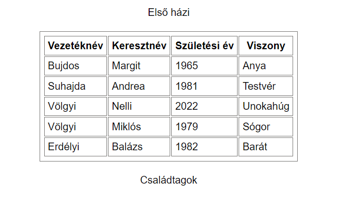

# elso_hazi

Hozz létre egy osztályt egy külön js fájlban, ami alkalmas arra, hogy táblázatban megjelenítse egy lista adatait. A main-js-ben példányosítsd, add át a listát és a szülőElemet, ahova elhelyezzük a táblázatot.

Create a class in a separate JavaScript file that can display a list of data in a table format. Create the object in main.js, pass the list and the parent element and place the table in the parent element.

